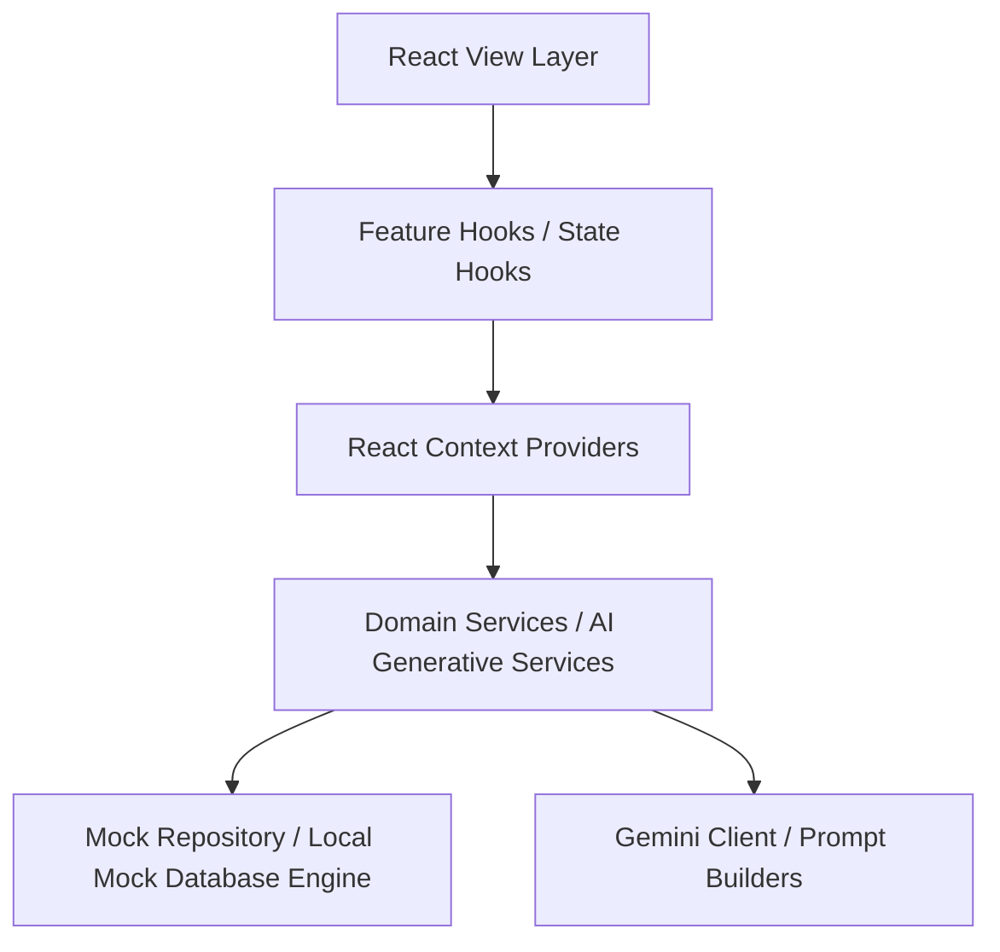

# Smart Stadiums & Tournament Operations Command Center
## Enterprise Architecture & Onboarding Guide

Welcome to the **StadiumOps AI** Command Center repository. This documentation is designed to onboard new engineers, explain system design trade-offs, and detail the technical architecture of this mission-critical console.

---

## 1. Project Overview & Architecture

StadiumOps AI is a single-page React console engineered for real-time monitoring, volunteer dispatch, crowd flow logistics, multilingual translation communications, accessibility assistance, and structured incident reporting.

### Layered Architecture Diagram



*   **View Layer (`src/components/`, `src/features/`):** Consists of layout shells and features. Strictly presentational; has no direct database or service references.
*   **Hooks Layer (`src/hooks/`):** Binds state contexts, keybindings, and page transitions to components cleanly.
*   **State Layer (`src/state/`):** Manages local state engines, metrics logs, and context providers composing the app stack.
*   **Service Layer (`src/ai/`, `src/notifications/`):** Contains business logic interfaces, command builders, and Gemini integrations.
*   **Repository Layer (`src/data/`):** Holds the local mock database engines, seeding modules, and raw schema types.

---

## 2. Directory Structure

```text
src/
├── accessibility/      # Reusable WCAG focus traps and live announcement utilities
├── ai/                 # Gemini API clients, retry loops, and prompt builders
├── command/            # Central registry and system command definitions
├── components/         # Shared UI buttons, cards, notification modals, layouts
├── config/             # Runtime environments and feature flag tokens
├── data/               # Seed databases and repository mock APIs
├── features/           # Modular views (dashboard, incidents, volunteers, crowd, settings)
├── hooks/              # Global custom hooks (keyboard key listeners, motion preferences)
├── logging/            # Central structured debugger (console wrapper)
├── monitoring/         # Trace context generator, performance tracers, health metrics
└── motion/             # Global easing constants, duration tokens, page transitions
```

---

## 3. Architecture Decision Records (ADRs)

### ADR 01: Client-Side Repository Pattern
*   **Context:** The Command Center must operate reliably in high-density stadium networks.
*   **Decision:** Implement a clean, local repository layer with mock seed data that mimics real asynchronous backend APIs.
*   **Rationale:** Decoupling the data layer ensures the interface compiles and functions identically whether connected to local mocks or configured for future live backend sockets.

### ADR 02: Central Command & Palette System
*   **Context:** Operators require mouse-free workflows to handle incoming arena alerts quickly.
*   **Decision:** Establish an in-memory `commandRegistry` containing category-mapped executables.
*   **Rationale:** Keeps keybindings (`Alt + Number`, `Ctrl + K`) out of component files, streamlining focus trapping and command searches.

---

## 4. Developer Onboarding

### Required Tools
*   **Node.js:** v20.x or higher
*   **Package Manager:** npm

### Getting Started

1.  **Install Dependencies:**
    ```bash
    npm ci
    ```
2.  **Run Development Server:**
    ```bash
    npm run dev
    ```
3.  **Run Type Checks:**
    ```bash
    npm run typecheck
    ```
4.  **Build Production Bundle:**
    ```bash
    npm run build
    ```

---

## 5. System Glossary

*   **TOC (Tournament Operations Center):** The central human team monitoring stadium events.
*   **Command Palette:** The search modal triggered via `Ctrl + K` allowing commands execution.
*   **Announcer:** Screen-reader live region broadcasting alerts dynamically.
*   **Trace Context:** Diagnostic session correlation ID matching user tasks to logger logs.
