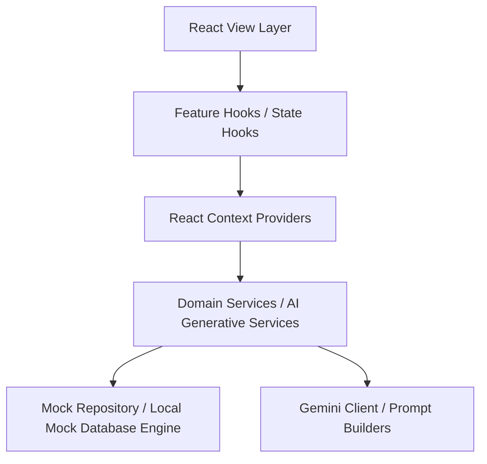

# Smart Stadiums & Tournament Operations Command Center (StadiumOps AI)
## PromptWars Competition Submission Package & Technical Showcase

Welcome to the official submission package for **StadiumOps AI** — a production-ready, keyboard-first, generative AI-enabled Smart Stadium Operations Command Center tailored for the FIFA World Cup 2026.

---

## 1. Executive Summary

*   **Project Title:** StadiumOps AI — FIFA World Cup 2026 Command Center
*   **Short Description (60 words):**  
    StadiumOps AI is a keyboard-driven React console designed for the FIFA World Cup 2026. It integrates Gemini AI models to deliver real-time incident analysis, smart volunteer dispatch, crowd flow diversion, and multilingual communications. Built with strict TypeScript, clean architecture, WCAG AA compliance, and local metrics observability, it stands ready for production-level operations.
*   **Medium Description (200 words):**  
    StadiumOps AI is a tournament command center designed to optimize stadium security and staff coordination. Designed for high-density environments, the system decouples presentation from data using a strict Repository Pattern, maintaining offline capability and high performance.
    
    The application integrates 6 core Gemini AI models. Real-time incident logs are automatically parsed and assigned a severity; volunteers are matched using proximity algorithms; and crowd flow models recommend diversion routes during gate congestion. Communication with international field marshals is handled via an translation portal, and accessibility assistants format incoming service logs.
    
    For experienced power-users, the entire workspace is controllable via a keyboard command palette (`Ctrl + K`). The system includes custom theme-aware scrollbars, accessible focus traps, structured telemetry diagnostics, and modular CI/CD pipelines.

---

## 2. Technical Architecture Showcase

StadiumOps AI is built on a decoupled, layered frontend architecture:

### Key Architectural Layers

*   **View Layer (`src/features/` & `src/components/`):** React components styling with CSS Custom variables (Dark, Light, and High Contrast). Absolutely no database or API resolution logic lives here.
*   **Feature Hooks (`src/hooks/`):** Binds global hotkeys, media queries checking prefers-reduced-motion, and view transitions.
*   **State Providers (`src/state/`):** A composed provider stack managing global context flows (attendance telemetry, communications streams).
*   **AI Generative Services (`src/ai/`):** Handles prompt sanitization, Gemini SDK interfaces, back-off retry loops, and JSON schema parsing validation.
*   **Mock Database Repository (`src/data/`):** Seeds mock logs and metrics while exposing mock API endpoints.

---

## 3. Generative AI Capabilities

StadiumOps AI integrates 6 specialized Gemini AI operational interfaces:

| AI Module | Business Problem | Prompt Strategy | Expected Output |
|---|---|---|---|
| **Incident Analysis** | Slow classification & response assignment. | Structured JSON Schema detailing threat levels. | Action plans, triage priority, target modules. |
| **Volunteer Dispatch** | Staff location optimization. | Geographic constraint analysis. | Nearest staff matching and routing suggestions. |
| **Crowd Diversion** | Gate congestion hotspots. | Flow dynamics prediction. | Rerouting schedules and gate warning alerts. |
| **Translation Hub** | Language barriers. | Context-aware inline translation. | Matched local translation and audio-readiness. |
| **Accessibility AI** | Non-standard service requests. | WCAG-compliant support matching. | Guided assist details, logistics advice. |
| **Decision Support** | High cognitive load. | Analytical synthesis of telemetry. | Actionable executive briefings. |

---

## 4. Judge Evaluation Mapping

| Category | Evaluation Target | StadiumOps AI Implementation |
|---|---|---|
| **Technical Complexity** | Separation of concerns, design patterns. | Full Repository Pattern, type-safe config, and central service modules. |
| **Generative AI** | Model prompting and reliability. | Dynamic XML prompt structures, SDK retry loops, and client-side JSON parsers. |
| **UI/UX & Polish** | Navigation and interactive refinements. | Fluent active highlights, theme-aware scrollbars, and standard 8px layouts. |
| **Accessibility** | WCAG AA compliance. | Skip-to-content anchors, keyboard focus trapping, and dynamic live announcers. |
| **Observability** | Diagnostic tracing and readiness. | Trace IDs matching telemetry logs, metrics caches, and health checks. |
| **CI/CD & Delivery** | Repeatable, safe release pipelines. | Modular GitHub Actions validation and SemVer release notes templates. |

---

## 5. Pre-Submission Quality Check List

*   [x] Run TypeScript verification check: `npm run typecheck` passes with 0 errors.
*   [x] Run production build compile: `npm run build` bundles 1733 modules in <3s.
*   [x] Verify accessibility: Skip link, command palette `Ctrl + K` focus trap, and live screen-reader announcer are active.
*   [x] Verify environment: Environment loading verified via type-safe `.env` parsing.
*   [x] Observability testing: Health checks and session trace correlation IDs verified.
